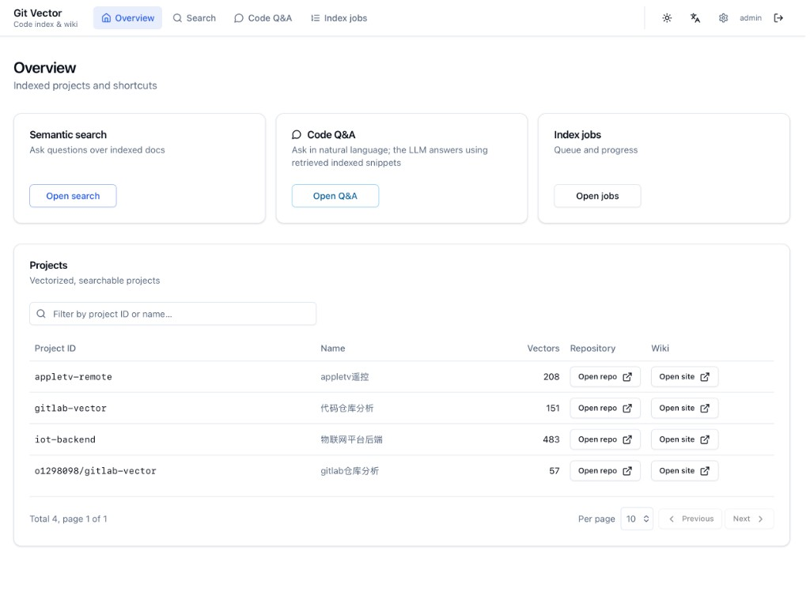
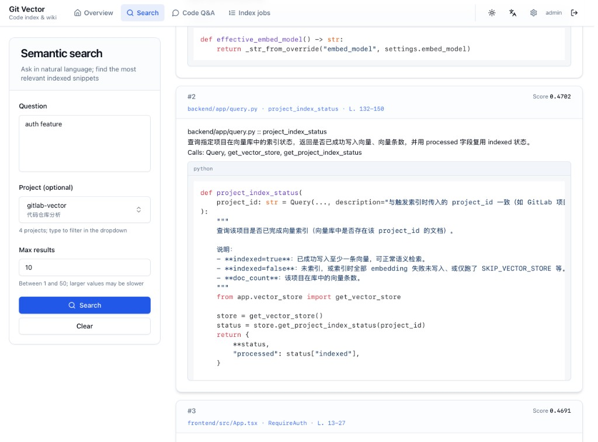

# Git 代码索引 → 向量库（Chroma）→ 语义检索（Dify / 管理端）

**Languages**: [English](README.md) | **中文**

本服务把 **Git 仓库**（GitLab / GitHub / Gitea 的 Webhook，或**任意可克隆 URL** 手动入队）索引成可检索的向量知识库：在 `main`/`master` 推送或手动触发时拉取代码，按**函数级**（解析不到则退化为**文件级**）切分 chunk，可选用 LLM 为每个 chunk 生成一行描述，再 embedding 写入 Chroma。可通过 HTTP API 检索、接入 Dify（API 工具）、使用自带 **管理端 `/admin/`**，以及调用 **代码问答** 接口。

## 界面预览

管理端（`/admin/`）：**概览**展示已索引项目与快捷入口；**语义检索**支持自然语言提问并返回相关代码片段。

| 概览 | 语义检索 |
|------|----------|
|  |  |

---

## 你会得到什么

- **自动索引**：支持 **GitLab、GitHub、Gitea** 的 `main`/`master` Push Webhook；其他托管可用 **手动触发** 或 CI 调用同一入队接口（串行 worker，避免并发写库失败）
- **可查进度**：入队返回 `job_id`，可随时查状态与进度
- **可语义检索**：结果含 `path`、`name`、`start_line`、`end_line` 等，便于定位代码
- **代码问答**（需配置 LLM）：`POST /api/code-chat` 及流式接口（详见 `/docs`）

---

## 仓库结构

| 路径 | 说明 |
|------|------|
| `backend/app/` | Python / FastAPI 服务与索引、Wiki、向量库逻辑 |
| `backend/requirements.txt` | 后端依赖 |
| `frontend/` | React + Vite 管理端（构建产物由后端挂载在 `/admin/`） |
| `docs/images/` | README 配图 |
| `LICENSE` | MIT 许可证全文 |
| `scripts/` | 本地/容器内辅助脚本 |

---

## 工作流（与代码一致）

```text
Webhook Push（GitLab / GitHub / Gitea，main/master）/ 手动触发（任意 Git URL）
  ↓
任务入队（SQLite 持久化，worker 串行执行）
  ↓
clone_or_pull：克隆/拉取（HTTPS 可选注入令牌，见下文「私有 HTTPS 克隆」）
  ↓
collect_files：扫描常见代码/配置文件（跳过 node_modules/.git/.env 等）
  ↓
parse_functions：Tree-sitter 函数级解析（0 条则 file-level fallback）
  ↓
describe_chunks（可选）：Dify / Azure OpenAI / OpenAI 生成一行描述
  ↓
generate_wiki：静态 Wiki（MkDocs / Starlight / VitePress，站内搜索）→ DATA_DIR/wiki_sites
  ↓
upsert_vector_store：embedding → Chroma 写入
  ↓
query/search：语义检索（供 Dify/前端调用）
```

---

## 快速开始（Docker）

### 1) 配置 `.env`

```bash
cp .env.example .env
```

常见最小配置：

- **私有 HTTPS 仓库**：配置 `GITLAB_ACCESS_TOKEN` 和/或 `GIT_HTTPS_TOKEN`（见下文「私有 HTTPS 克隆」）；**GitHub PAT** 常配合 `GIT_HTTPS_USERNAME=x-access-token`
- **向量化**：确保 `OLLAMA_BASE_URL` 可访问，且 Ollama 已具备 `EMBED_MODEL` 对应模型（与 `.env.example` 默认一致即可起步）
- **可选 LLM**：描述生成与代码问答按优先级三选一（见「LLM 优先级」）

### 2) 启动

```bash
docker compose up -d
```

- **服务地址**：`http://localhost:8000`
- **接口文档**：`http://localhost:8000/docs`
- **代码改动后重建**：`docker compose build --no-cache && docker compose up -d`

---

## Webhook（推送自动索引）

各平台 Webhook **仅在 `main` 或 `master` 推送**时入队索引。入队成功时响应里带 `job_id`。

若对应 **密钥环境变量未配置**，则**跳过验签**（方便内网调试；**公网暴露服务时不建议**）。

### GitLab

项目 **Settings → Webhooks**：

- **URL**：`http://<服务地址>:8000/webhook/gitlab`
- **Secret**：与 `GITLAB_WEBHOOK_SECRET` 一致（与当前 GitLab 配置方式一致即可）
- **Trigger**：**Push events**
- 仅处理 `object_kind=push`。

### GitHub

仓库 **Settings → Webhooks → Add webhook**：

- **Payload URL**：`http://<服务地址>:8000/webhook/github`
- **Content type**：`application/json`
- **Secret**：与 `GITHUB_WEBHOOK_SECRET` 一致（验签头 `X-Hub-Signature-256`）
- **Events**：仅 **push**（`ping` 会忽略并返回成功）

### Gitea

仓库 **Settings → Webhooks**：

- **URL**：`http://<服务地址>:8000/webhook/gitea`
- **Secret**：与 `GITEA_WEBHOOK_SECRET` 一致（验签头 `X-Gitea-Signature`，body 的 HMAC-SHA256 十六进制）
- **Events**：**Push**

---

## 私有 HTTPS 克隆

对**无内嵌用户名密码的 HTTPS URL**，Worker 会在 clone 时注入 Basic 认证：

| 变量 | 作用 |
|------|------|
| `GIT_HTTPS_TOKEN` | 若设置则**优先于** `GITLAB_ACCESS_TOKEN` |
| `GITLAB_ACCESS_TOKEN` | 仍可用（如 GitLab `read_repository` 的 PAT） |
| `GIT_HTTPS_USERNAME` | 用户名；留空时默认 **`oauth2`**（适合 GitLab）。**GitHub** 请设为 **`x-access-token`** |

管理端 **设置**（`/admin/`）也可覆盖 **HTTPS 用户名**；访问令牌字段对应环境变量仍以 `GITLAB_ACCESS_TOKEN` 为主，与 `GIT_HTTPS_TOKEN` 二选一即可（后者优先）。

---

## 不配 Webhook：手动触发索引

### 方式 A：`/webhook/trigger`

```bash
curl -X POST "http://localhost:8000/webhook/trigger" \
  -H "Content-Type: application/json" \
  -d '{"repo_url":"https://github.com/acme/backend.git","project_id":"acme/backend","project_name":"我的项目"}'
```

`repo_url` 可为任意本环境能 **`git clone` 的 HTTPS 或 SSH** 地址。可选 **`project_name`**：展示名/中文名，写入任务与 Wiki 首页、`manifest.json`。

### 方式 B：`/api/index-jobs/enqueue`（等价入队接口）

```bash
curl -X POST "http://localhost:8000/api/index-jobs/enqueue" \
  -H "Content-Type: application/json" \
  -d '{"repo_url":"https://github.com/acme/backend.git","project_id":"acme/backend","project_name":"我的项目"}'
```

---

## 查询（供 Dify 或前端调用）

### 语义检索

- **POST** `/api/query`

```bash
curl -X POST "http://localhost:8000/api/query" \
  -H "Content-Type: application/json" \
  -d '{"query":"用户登录是怎么实现的？","project_id":"my-repo","top_k":10}'
```

- **GET** `/api/search`

```bash
curl "http://localhost:8000/api/search?q=登录&project_id=my-repo&top_k=10"
```

返回结构：

```json
{
  "results": [
    {
      "score": 0.123,
      "content": "...",
      "metadata": {
        "path": "app/auth.py",
        "name": "login",
        "kind": "function",
        "start_line": 10,
        "end_line": 88
      }
    }
  ]
}
```

### 项目列表 / 索引状态

- **GET** `/api/projects`：列出向量库中已索引的项目及文档数；每项含 `project_name`（展示名，可为 `null`）；可选 `q`（匹配 `project_id` 或 `project_name` 子串）、`limit`/`offset` 分页（不传 `limit` 时返回全量，兼容旧用法）
- **GET** `/api/project/index-status?project_id=xxx`：查看某项目是否已写入向量（`indexed/doc_count`）

### 静态 Wiki（MkDocs / Starlight / VitePress）

索引任务在「向量化」之前会自动执行 Wiki 构建（失败仅打日志，不阻断向量写入）。默认 **`WIKI_BACKEND=mkdocs`**（Material 主题，纯 Python）。可选 **`starlight`**（Astro）或 **`vitepress`**：界面更偏现代前端文档站。仓库自带 **Dockerfile 已包含 Node.js / npm**；裸机部署时则需自行安装。首次构建会在 `wiki_work/<project_id>` 内执行 `npm install`（需能访问 npm 源）。产物仍在 `DATA_DIR/wiki_sites/<project_id>/site/`，由本服务静态挂载：

- **浏览器访问**：`http://<host>:8000/wiki/<project_id>/site/`（`project_id` 与索引时一致；与 `repos` 目录名相同规则，非字母数字会替换为 `_`）
- **元数据**：`GET /api/wiki/{project_id}` → `manifest.json`（含 `wiki_backend`、提交 SHA、生成时间、`chunk_count` 等）

Wiki 含：首页元数据与 README 摘录、架构总览（已配置 LLM 时自动生成）、文件索引（树状目录）、按文件的符号说明页、符号总表（过大时自动分卷）。**功能说明** 仅使用索引阶段 LLM 为每个函数生成的描述（与 `describe_chunks` 写入向量库的一致）；源码 docstring 若与 LLM 描述不同，会在 **源码文档** 中另列。MkDocs 下站内搜索为 Lunr（英文分词为主）；Starlight / VitePress 使用各自本地搜索方案。

---

## 索引队列与进度查询

本服务默认使用**队列串行执行**索引任务（避免并发写 Chroma / 本地 repos 导致失败），任务状态持久化到 SQLite，服务重启后仍可查询历史记录。

- **查看任务列表**：`GET /api/index-jobs?limit=50&offset=0`（可选 `status` / `project_id` 过滤；响应中 `total` 为符合条件的总条数，`jobs` 为当前页，`limit`/`offset` 与请求一致）
- **查看单个任务**：`GET /api/index-jobs/{job_id}`

关键字段：

- **status**：`queued` / `running` / `succeeded` / `failed` / `cancelled`
- **progress**：0-100
- **step**：阶段名（如 `clone_or_pull` / `parse_functions` / `generate_wiki` / `upsert_vector_store`）
- **message**：更友好的中文阶段说明

---

## 环境变量

| 变量 | 说明 |
|------|------|
| `GITLAB_WEBHOOK_SECRET` | GitLab Webhook 密钥（不配则不校验） |
| `GITHUB_WEBHOOK_SECRET` | GitHub Webhook 密钥（`X-Hub-Signature-256`；不配则不校验） |
| `GITEA_WEBHOOK_SECRET` | Gitea Webhook 密钥（`X-Gitea-Signature`；不配则不校验） |
| `GITLAB_ACCESS_TOKEN` | HTTPS 克隆令牌；若未设 `GIT_HTTPS_TOKEN` 则使用此项 |
| `GIT_HTTPS_TOKEN` | HTTPS 克隆令牌，**优先于** `GITLAB_ACCESS_TOKEN` |
| `GIT_HTTPS_USERNAME` | HTTPS 用户名（默认 `oauth2`；GitHub 常用 `x-access-token`） |
| `GITLAB_EXTERNAL_URL` | 可选；概览「打开仓库」无任务内 `repo_url` 时与 `project_id` 拼接（GitLab 风格路径） |
| `DIFY_API_KEY` | Dify 应用 API Key（用于为 chunk 生成一行描述） |
| `DIFY_BASE_URL` | Dify API 地址，默认 `https://api.dify.ai/v1` |
| `AZURE_OPENAI_API_KEY` | Azure OpenAI Key |
| `AZURE_OPENAI_ENDPOINT` | Azure Endpoint（如 `https://xxx.cognitiveservices.azure.com`） |
| `AZURE_OPENAI_VERSION` | Azure API version |
| `AZURE_OPENAI_DEPLOYMENT` | Azure 部署名 |
| `OPENAI_API_KEY` | OpenAI（或兼容接口）Key |
| `OPENAI_BASE_URL` | 兼容接口地址（默认 `https://api.openai.com/v1`） |
| `OPENAI_MODEL` | 模型名/部署名 |
| `DATA_DIR` | 数据目录（默认 `./data`；容器内常用 `/data`） |
| `OLLAMA_BASE_URL` | Ollama 地址（代码默认 `http://localhost:11434`；Docker 场景常用 `http://host.docker.internal:11434`） |
| `EMBED_MODEL` | Ollama **embeddings** 模型名（须在 Ollama 中存在）。**更换模型后需清空 `DATA_DIR/chroma` 并重新索引**（维度会变） |
| `SKIP_VECTOR_STORE` | 设为 `1` 时只跑 clone/解析/（可选 LLM），不写入 Chroma（用于本地验证流程） |
| `INCREMENTAL_INDEX` | 设为 `1` / `true` 时启用**增量向量**（见下）；默认关闭。需 `project_index.sqlite3` 中已有 `last_indexed_commit` 且库内为 `gv2_` 前缀稳定 id，否则会**自动全量** |
| `FORCE_FULL_INDEX` | 单次索引任务强制**全量**向量（忽略增量） |
| `WIKI_BACKEND` | `mkdocs`（默认） / `starlight` / `vitepress`；后两者需 Node.js + npm（官方 Docker 镜像已带） |
| `WIKI_ENABLED` | `false` / `0` 关闭索引结束后的 Wiki 生成（默认开启） |
| `SKIP_WIKI` | `1` 跳过 Wiki（不改变 `WIKI_ENABLED` 配置） |
| `WIKI_KEEP_WORK` | `1` 保留 `wiki_work/<project_id>` 中间目录 |
| `WIKI_MAX_FILE_PAGES` | 最多为多少个路径单独生成文件说明页（默认 `5000`） |
| `WIKI_SYMBOL_ROWS_PER_FILE` | 符号索引每个 Markdown 表格最大行数（默认 `4000`） |
| `NPM_REGISTRY` | 可选。`WIKI_BACKEND=starlight` / `vitepress` 时 `npm install` 使用的源；非空则写入子进程的 `npm_config_registry`。也可不设此项，在环境中配置 **`npm_config_registry`** 或 **`NPM_CONFIG_REGISTRY`**（后者会由本服务映射为 `npm_config_registry`）。 |

### LLM 优先级（只会选一个）

用于“为函数/文件生成一行描述”的 LLM 按以下优先级自动选择：

1. **Dify**：配置 `DIFY_API_KEY`（可选 `DIFY_BASE_URL`）
2. **Azure OpenAI**：配置 `AZURE_OPENAI_API_KEY` + `AZURE_OPENAI_ENDPOINT`
3. **OpenAI 兼容**：配置 `OPENAI_API_KEY`

不配置任何 LLM 时仍可索引与检索，只是 `content` 里不会附加自然语言描述（仍包含路径/名称/代码片段）。

---

## 数据与持久化

默认在 `DATA_DIR` 下：

- **仓库镜像**：`DATA_DIR/repos/<project_id>/...`
- **向量库**：`DATA_DIR/chroma/`
- **索引任务 DB**：`DATA_DIR/index_jobs.sqlite3`
- **项目向量元数据缓存**：`DATA_DIR/project_index.sqlite3`（`doc_count`、展示名，以及增量用的 `last_indexed_commit` / `last_embed_model`）
- **静态 Wiki**：`DATA_DIR/wiki_sites/<project_id>/site/`（及 `manifest.json`；中间文件默认在 `wiki_work/` 构建后删除）

---

## 开发（本地调试）

```bash
python3 -m venv .venv
source .venv/bin/activate
pip install -r backend/requirements.txt
cp .env.example .env
cd backend && uvicorn app.main:app --host 127.0.0.1 --port 8000 --reload
```

管理端本地开发（可选，另一终端；需配置 `CORS_ORIGINS=http://localhost:5173`）：

```bash
cd frontend && npm install && npm run dev
```

补充说明：

- 在 `backend/` 下启动时，默认 `DATA_DIR=./data` 会落在 `backend/data/`；若希望数据仍在仓库根目录，可在 `.env` 中设置 `DATA_DIR=../data`。
- 服务启动时会尝试启动索引队列 worker；向量库/embedding 相关对象通常在首次索引或首次查询时才会加载。
- 看到日志 `No function-level chunks parsed ...; using file-level fallback` 表示函数级解析得到 0 条，已自动退化为文件级 chunk（检索仍可用，只是粒度变粗）。

---

## 许可

本项目以 [MIT](LICENSE) 许可证发布。
